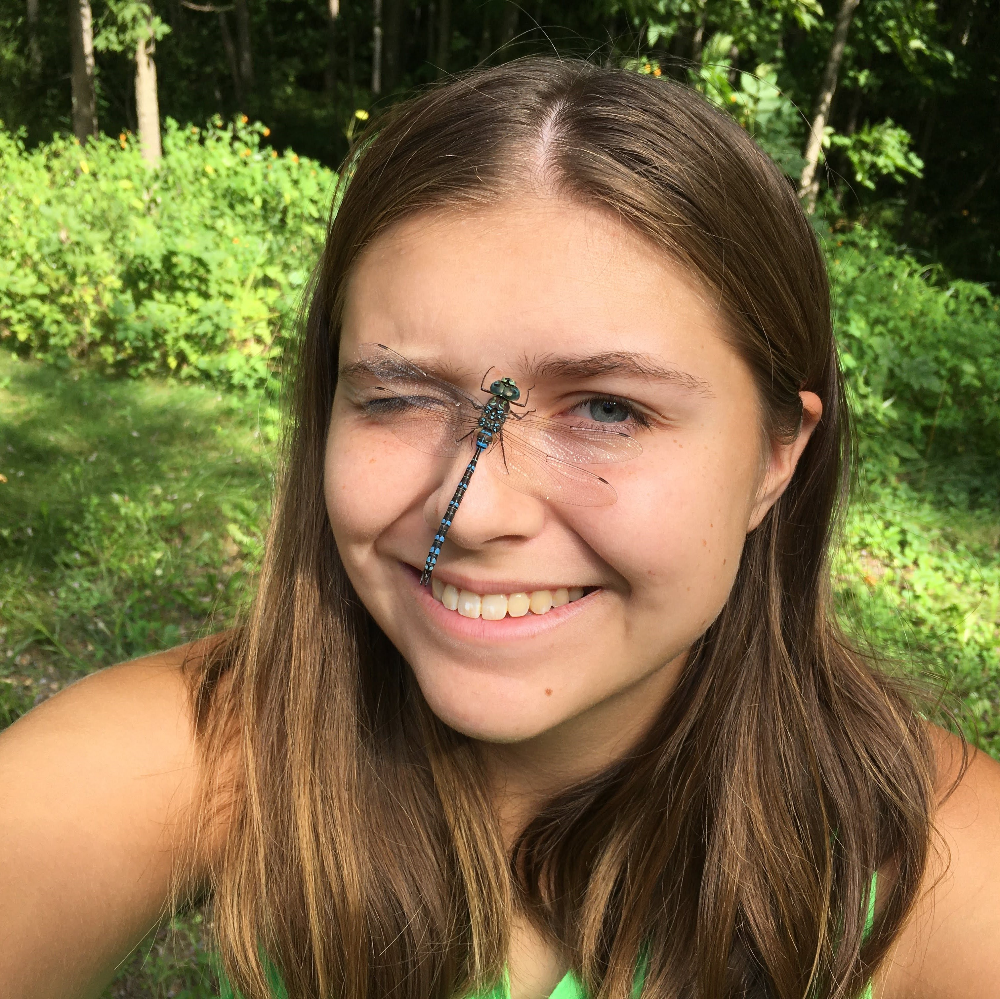

&nbsp;&nbsp;&nbsp;[University of Toronto Mississauga](https://www.utm.utoronto.ca/biology/people/hannah-bodmer)

&nbsp;&nbsp;&nbsp;[LinkedIn](https://www.linkedin.com/in/hannah-bodmer)

&nbsp;&nbsp;&nbsp;[GitHub](https://github.com/hmbodmer)

&nbsp;&nbsp;&nbsp;[ResearchGate](https://www.researchgate.net/profile/Hannah-Bodmer)
